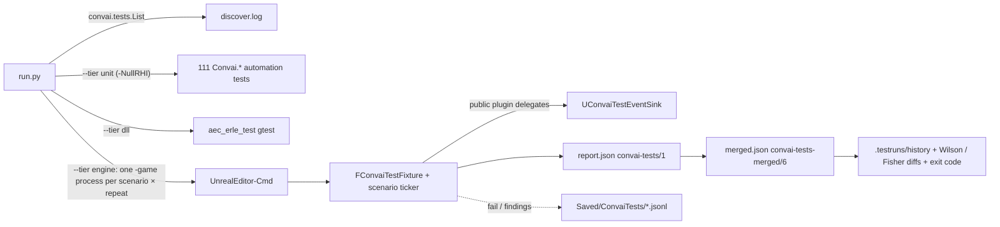
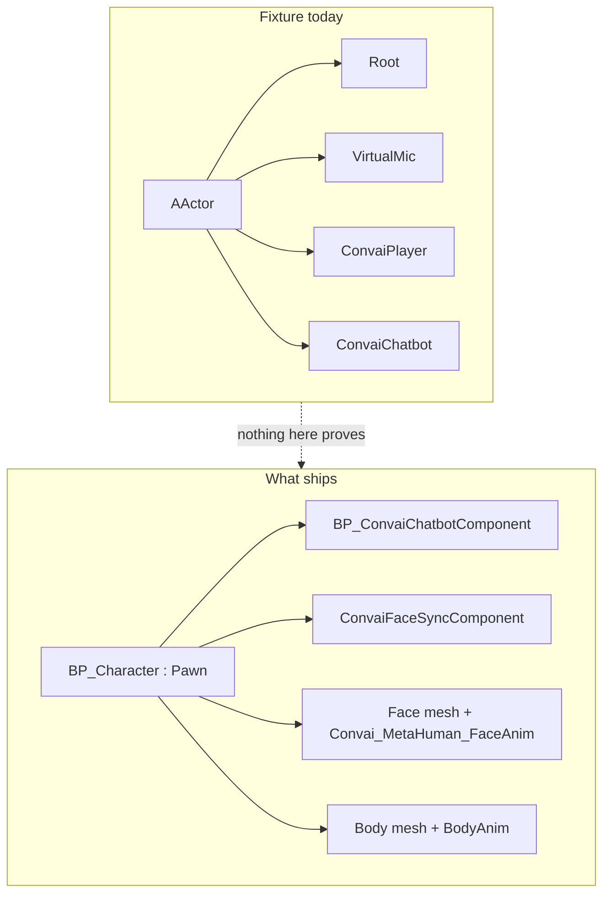
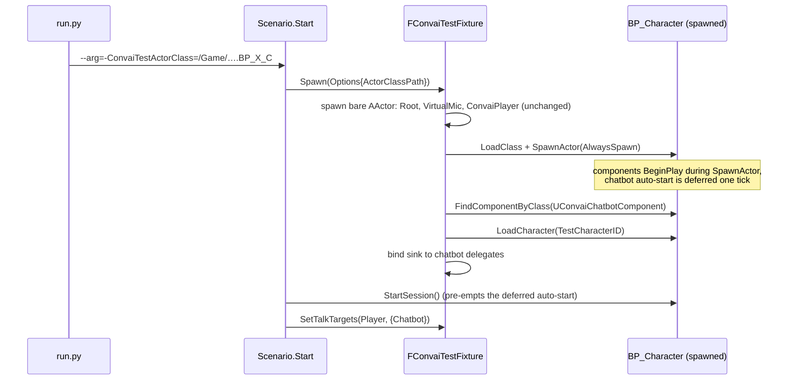
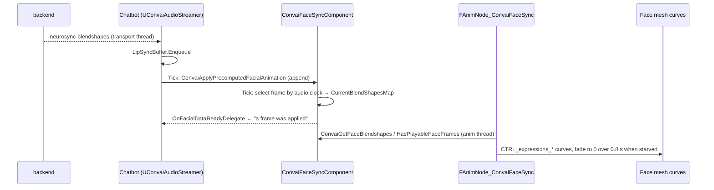

# Convai end-to-end release testing

Status: proposed — trimmed 2026-08-28 after review; baselined on `WebRTC-Video` at `7a1d3636`
Audience: `ConvaiTests` maintainers and the agents that run it
Related: [Docs/ConvaiTests.md](ConvaiTests.md) (how to run) · [.scratch/test-framework/PRD.md](../.scratch/test-framework/PRD.md) (why it exists) · [ADR 0004](adr/0004-test-layer-partition.md) · [ADR 0005](adr/0005-tests-as-a-strippable-module.md) · ConvaiTasks #232

## 1. What this is

`ConvaiTests` already runs real Unreal processes against the live backend, feeds deterministic
audio through the public capture seam, grades from a per-scenario JSON report, and merges
repeats into rates with confidence intervals. What nothing proves yet is the thing a customer
ships: a **character Blueprint** — chatbot component, face-sync component, MetaHuman face mesh,
the plugin's face AnimBP — spawned in a level, talking, with lip-sync visibly applied to the mesh.

This document closes that gap on the existing runner, in order, and says what is deliberately
deferred:

| Deferred | Why | Revisit when |
|---|---|---|
| Desktop launcher (PySide6) | Agents run the CLI; humans read the report. Six-line invocation already documented. | A second human operator needs it |
| Python package split, typed job/event model, stop semantics | Only needed by the launcher. `run.py` is importable and covered by 21 checks. | Something other than `run.py` must drive a sweep |
| Baseline registry, retention planner, replay manifests, JSON schemas | `merged.json` + `history/` + oracle/binary fingerprints already do the job on one disk. | Evidence leaves this workstation |
| Video, screenshot goldens, ProcDump | Structured oracles are authoritative; visuals only supplement. | A visual regression escapes the structured oracles |

## 2. Where we are



27 engine scenarios on this branch (15 need a character, 16 connect): session lifetime,
server-error delivery, text/audio round trips, bot emotion, actions, six AEC arms, capture and
routing, five Reference Audio arms, Knowledge Bank (opt-in). All spawn a **bare `AActor`** with
native components and run on `/Engine/Maps/Entry`.

Standing reds and noise every live run sees (from `.scratch/test-framework/FINDINGS.md`,
`ISSUES.md`): F26 and F12/F34 (AEC) are product-red; five live scenarios flake at 20–40 %
(I10); `bot-turn-completed` goes missing on the speech-in path at a backend-driven rate (I5);
F10 lip-sync starvation is open with no mechanism recorded. A gate that fails on any mixed
outcome would fail every run — see §8.

## 3. The gap



Not proved on any branch: a Blueprint character connects and answers; lip-sync frames reach the
face-sync component and move the face mesh's curves; the face returns to neutral after the turn.
Also not proved: pawn movement / gaze selection — that is Room work and lives in §7.

## 4. Configured-world fixture

One new input, read the way the Knowledge Bank opt-in is read; no change to the Python runner
and no change to the shipping module (ADR 0005).



Rules:

- Empty `-ConvaiTestActorClass=` → the bare fixture, exactly as today. A path that does not load
  or a class with no chatbot component → `setup_failed`, never `fail`.
- The player and Virtual Mic stay on the bare actor. The Blueprint keeps its own components, so
  mic adoption order is unchanged and nothing is doubled.
- Scenarios read the bot's speaker name from the component (`Chatbot->GetName()`), not the
  literal `ConvaiChatbot` — a Blueprint's component is named by its SCS node.
- One Blueprint per process; the map stays `/Engine/Maps/Entry`. Level-placed characters
  auto-start and take the session, so never run these on `Landing`.
- In this project the class is `/Game/Blueprints/BP_Hana.BP_Hana_C` (Pawn; chatbot, face sync,
  `Hana_FaceMesh`, `Convai_MetaHuman_FaceAnim`). The plugin ships no MetaHuman; the path is an
  input, not a constant.

## 5. Lip-sync oracle

Everything below is public surface a customer's Blueprint could bind.



| Claim | Signal | Metric | Pass rule |
|---|---|---|---|
| Frames reached the component | `OnFacialDataReadyDelegate` count while `GetIsTalking()` | `face_frames_applied`, `face_first_frame_ms`, `face_max_weight` | count > 0 |
| Face mesh moved | `FaceMesh->GetAnimInstance()->GetCurveValue("CTRL_expressions_jawOpen")` sampled each tick while talking | `mesh_jaw_max`, `mesh_first_curve_ms` | `mesh_jaw_max` ≥ 0.05 |
| Returned to neutral | same curve once `GetIsTalking()` goes false | `mesh_neutral_after_ms` | curve < 0.01 within 5 s of finishing |
| Starvation | longest window of `HasPlayableFaceFrames()==false` while talking | `face_starvation_max_ms` | metric only (F10 is open); finding when it exceeds `LipSyncStarvationFallback` |

What the oracle must not claim:

- **Packet receipt.** Blendshape packets are excluded from the packet log and receipt happens on
  the transport thread with no public event. The first applied frame is the first observable.
- **Neutral via the blendshape map.** `ConvaiGetFaceBlendshapes()` keeps the last frame after a
  turn; only the anim node fades. Neutral is read from the mesh curve.
- **Server speaking state.** `OnStartedTalking`/`OnFinishedTalking` are local playback, one
  frame late. The scenario ends on `OnFinishedTalking` + neutral, not on `bot-turn-completed`
  (I5 loses it ~5/10 on speech-in).

The face mesh must animate off-screen: the fixture sets `VisibilityBasedAnimTickOption` to
always tick on the character's skeletal meshes. Positive control per ADR 0004 is built in:
`-ConvaiFaceSyncSimulateFreeze=1` provokes a 1–4 s freeze and must move `face_starvation_max_ms`.

## 6. Scenarios on this branch

| Scenario | Inputs | Proof | Deadline |
|---|---|---|---|
| `configured_text_roundtrip` | actor class, character | Blueprint chatbot connects, bot transcript, turn completed | 180 s |
| `configured_audio_roundtrip` | actor class, character | WAV through Virtual Mic → player transcript → bot reply | 180 s |
| `configured_lipsync` | actor class, character | table in §5 | 180 s |

All three are `setup_failed` without `-ConvaiTestActorClass=`; existing scenarios are untouched.

```
python Source\ConvaiTests\run.py --tier engine --filter configured --repeat 5 `
  --project "E:\UEProjects\UE5.8\Dev_WebRTC\Dev_WebRTC.uproject" `
  --editor  "E:\Software\UE_5.8\Engine\Binaries\Win64\UnrealEditor-Cmd.exe" `
  "--arg=-ConvaiTestActorClass=/Game/Blueprints/BP_Hana.BP_Hana_C" `
  "--arg=-ConvaiTestCharacterID=<id>"
```

PowerShell, not Git Bash — MSYS rewrites `/Game/…` paths.

## 7. Multi-character — lands on `feat/multi-character`

That branch merges `WebRTC-Video` and adds, on top of the same fixture:

- **Explicit switch**: `UConvaiSubsystem::SetConversationPartner(Chatbot)` acknowledged by
  `OnConversationPartnerChanged`; only the addressed Membership's transcript delegate answers
  (already proved on bare actors by `room_live_target_switch`; the configured variant proves it
  on Blueprints, and for lip-sync: the addressed clone animates, its twin does not).
- **Gaze arm**: `bGazeSelectsConversationPartner` on the player, pawn teleported to an anchor,
  wait for the partner change, then the same routing proof. Selection is gaze (view-centredness
  within max distance), not proximity.
- **Constraint (ADR 0007)**: a Room forms from the count of level-placed auto-starting chatbots;
  runtime-spawned ones are not counted. Configured Room attempts pass the `MultiCharacterRoom=1`
  custom param per process, as `room_live_*` already do.

Glossary for these terms (Room, Membership, Conversation Partner, Attribution) is that branch's
`CONTEXT.md`; it is not on `WebRTC-Video`.

## 8. Gate, when there is one

- Per-scenario floor on the Wilson lower bound of the pass rate, declared per scenario; never a
  `fail_on_flaky` boolean — with ~16 live scenarios × 10 repeats the probability of zero mixed
  outcomes is ≈ 2 % even at a 2 % per-attempt failure rate.
- Hotfix comparisons use a **contemporaneous alternated control arm** (the methodology already
  used for the 0.2.10 study), not a stored baseline; the backend moves within a day.
- Binary and asset hashes are **identity**, recorded in every report; they are not part of any
  compatibility key, or no release ever has a comparable baseline.
- Quarantine is an explicit entry with owner and expiry and is reported prominently; it does not
  turn a gate green.

## 9. Order of work

1. Fixture option + `configured_text_roundtrip` / `configured_audio_roundtrip` (this branch).
2. `configured_lipsync` with the §5 metrics; starvation control arm.
3. `feat/multi-character` merges `WebRTC-Video`; Room variants and gaze arm (§7).
4. Static HTML summary next to `merged.json`; per-scenario floors (§8).
5. Everything in the §1 table stays deferred until its trigger fires.

## 10. Risks

| Risk | Handling |
|---|---|
| Blueprint load/spawn is slow or fails off-screen | 180 s deadline (watchdog 2×); `AlwaysSpawn`; forced anim tick; precise `setup_failed` reasons |
| F10 starvation makes lip-sync flaky | Reported as a metric first; `SimulateFreeze` control proves the detector; finding threshold only after rates are known |
| Blueprint behaviour changes under the test (BP_Hana is project content) | Class path is an input; the report records the path; the plugin ships no test MetaHuman |
| Speaker-name coupling | Scenarios read `Chatbot->GetName()`; the bare fixture keeps `ConvaiChatbot` |
| Backend nondeterminism | Repeats, Wilson intervals, control arms; never retry-until-green |
