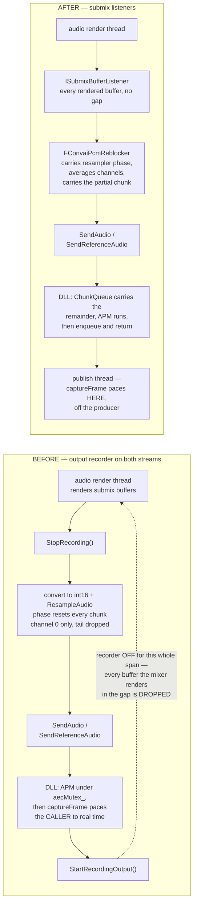

# Handoff — AEC: the mic and far-end streams were drifting apart

Overnight 2026-08-31 → 09-01. Two repos, both merged and pushed. Everything measured is in
[`.scratch/test-framework/FINDINGS.md`](../../.scratch/test-framework/FINDINGS.md) **F39** —
read that before forming any new hypothesis, and read F1–F38 before re-opening anything it
says was ruled out.

| Artifact | What it holds |
|---|---|
| `FINDINGS.md` F39 | the measurements, the two defects the instrument caught in its own change, and what is still open |
| `FINDINGS.md` F14, F27, F29, F32, F33, F35, F36, F37 | the chain that led here. **Do not re-litigate it.** |
| [ConvaiTasks #239](https://github.com/ar-convai/ConvaiTask/issues/239) | board item, status `Sync` |
| `docs/AEC_NEAR_END_SUPPRESSION.md` (DLL repo) | the double-talk defect that is still open |

## What was wrong

The canceller was never the problem — offline it reads 40–49 dB ERLE, in-engine it read ~3 dB.
Both audio streams were tapped with UE's **output recorder**, which is stopped for the whole of
each cycle's convert-and-send. The mixer *drops* what it renders while the recorder is off; it
does not buffer it. The mic side lost more than the far-end side, so the two timelines walked
apart at 10–25 ms per second of audio. A canceller can model a fixed delay. It cannot model a
delay that grows for the length of a conversation.



Two independent losses fed the same symptom, and both are closed:

- **the gap** — the recorder-off window, on both taps
- **the tail** — `ResampleAudio` dropped a frame per call and restarted its fractional phase
  every chunk; `SendReferenceAudio` in the DLL dropped the sub-480 remainder of *every* call

`aec_stream_parity` (mic chunks ÷ reference chunks over one window) went **0.9923 → 1.0000**,
ranges non-overlapping across 10 runs per arm. That is the result. The transcript leak rate is
not — see F39's "What it does not claim".

## The thing that matters most for the next session

**Parity is the oracle now.** `aec_stream_parity`, `feed_capture_ratio` and
`feed_recorder_off_max_ms` are deterministic and they separate. The transcript leak rate is a
coin at these effect sizes (F32) and did *not* separate taps from recorder. If you change
anything in the audio path, read parity first; a run whose parity is not ~1.000 tells you
nothing about cancellation.

**The taps are default-on.** `MicCaptureTap` / `ReferenceCaptureTap` default to `Listener`;
pass `Recorder` to either for an A/B against the old path in the same build.

**Two capture paths must stay exclusive.** The guard lives in `StartVoiceChunkCapture` /
`StopVoiceChunkCapture`, not in the tick — `StartRecording`, `UnmuteStreamingAudio` and the
mic-health restart all arm the recorder directly. Guarding only the tick let both paths route
the same audio and parity read **2.08**. Any new caller of those two functions inherits the
guard; any new path that arms the recorder itself will silently double the mic stream.

## Verified environment facts

- Harness runs stay on `/Engine/Maps/Entry`. `L_AEC` places a real `BP_HandsFreePlayer`, whose
  live capture component trips the scenario's own `default_capture_active` gate. `L_AEC` is for
  PIE / by-ear checking.
- Run from **PowerShell**, not Git Bash (MSYS rewrites the map path):
  ```
  python Source\ConvaiTests\run.py --project "E:\UEProjects\UE5.8\Dev_WebRTC\Dev_WebRTC.uproject" `
    --editor "E:\Software\UE_5.8\Engine\Binaries\Win64\UnrealEditor-Cmd.exe" `
    --tier engine --repeat 10 --filter aec_echo_only_internal `
    "--arg=-ConvaiTestCharacterID=bae40462-9091-11ef-ae8a-42010a7be011"
  ```
- **Staging the DLL takes two copies.** `stage-convai-client.bat` writes `Source\ThirdParty`;
  `Convai.cpp` only copies from there into `Binaries\Win64` when the file is *missing*. Copy
  into `Binaries\Win64` as well or the editor grades the old binary (F37 lost a whole sweep to
  this).
- Offline AEC oracle is back in the DLL repo: `tests/aec_erle_test.cpp`, run via
  `ctest --preset windows-x64-tests` (27 tests, 1 skipped — the skip is the open F12 defect).

## State of the tree

All four branches pushed and in sync with origin. Versions were pumped after the merges.

| Repo / path | Branch | HEAD | Note |
|---|---|---|---|
| `Convai-UnrealEngine-SDK-Dev` | `WebRTC-Video` | `3405965c` | the fix |
| `Convai-UnrealEngine-SDK-Dev` | `feat/multi-character` | `837fe875` | merged from `WebRTC-Video` |
| `E:\Livekit\convai-livekit-cpp-p` | `staging-v2` | `eb84d82` | v0.2.14 |
| `E:\Livekit\convai-livekit-cpp` | `staging-v3` | `49e5a51` | v0.3.3 |

The plugin calls `GetAECStats` and `SetStreamDelay`, which exist only from **0.2.14 / 0.3.3**.
`lib/` is gitignored, so the binary does not travel with the merge — a clean checkout needs a
published DLL at or above those versions or it will not link. Tracked as
[#235](https://github.com/ar-convai/ConvaiTask/issues/235).

**Neither `staging-v3` nor `feat/multi-character` has been compiled since its merge** — the
build was explicitly out of scope for that step. `staging-v3` merged the AEC work into 21
commits of roster-ABI change it was never built against; the conflict resolutions there were
verified by grep and by the vendored header coming out byte-identical to the DLL's, not by a
compiler. Build both before leaning on them.

## Next session

1. Build `staging-v3` and `feat/multi-character`. Nothing else should start before that.
2. Sweep `AECStreamDelayMs`, now that drift is gone. F35 swept it against a drifting stream and
   got nothing; it has never been swept against aligned streams. The knob is wired and
   defaults to unset; `aec_stream_delay_ms` labels the arm, `-1` meaning never called.
3. Double-talk (F12) is the remaining defect and it is **not** in this codebase — it is the
   AEC3 suppressor gating on far-end activity, in vendored `client-sdk-rust`. Measured 0/3 on
   both arms, so it is unrelated to this work.

Skills worth reaching for: **`diagnose`** if AEC regresses (the loop it enforces is what
produced F36–F39), and **`tdd`** for anything touching the re-blocker or the chunk carry —
both already have runnable checks (`ChunkQueueCarry.*` in the DLL suite).
