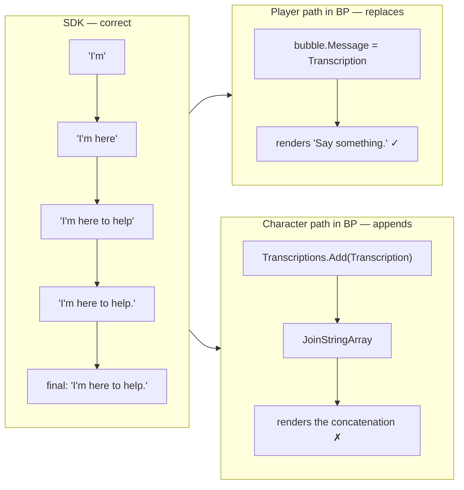

# Handoff — Chat_WB prints the character's reply once per token

> **Superseded 2026-09-01. The diagnosis below is wrong in its central claim.**
>
> This document says the SDK stream is settled and the defect is confined to Blueprint
> ("What the SDK sends (settled, verified, leave it alone)"). Both halves of that are wrong:
>
> - **The character regression is a C++ change.** `aa48ebdc` changed `OnBotTranscript` from
>   forwarding the raw `bot-transcription` sentence to broadcasting the whole turn so far, and
>   added an `OnBotLLMText` broadcast that beta.27 does not have. beta.27's plugin, with a
>   byte-identical `Chat_WB.uasset`, renders correctly — proving the widget was never the
>   variable. The widget's append branch is correct for disjoint chunks; the C++ stopped
>   sending those.
> - **The player path was broken by `253cde0e`, not fixed by it.** `AdvanceUserTurn` assumed
>   `user-transcription` is always word-sized deltas. It is cumulative on a live-mic session and
>   delta through the test harness, and nothing in the packet says which.
>
> The "live-measured on prod, 87 broadcasts" evidence covered **4 character utterances and no
> player utterance**, and `115/115` included a unit test that asserted the delta shape as an
> axiom rather than measuring it. Neither was evidence for the claim it was used to support.
>
> Current state: see the Unreleased section of `Docs/InternalChangelog.md`. The character's
> broadcasts were reverted to the beta.27 shape, so **no Content change ships and `Chat_WB`
> is untouched**; the player keeps the per-packet shape handling in `AdvanceUserTurn`, and
> `ConvaiTestSteps::TranscriptShapeFinding` is the coverage that was missing.

2026-09-01. The **C++ half is done, merged and verified — do not re-open it.** What is left is
entirely in Blueprint content, and this session never had `unreal-mcp` (ConnectionRefused for its
whole life), so the graphs were never opened. That is the only reason this is a handoff.

| Artifact | What it holds |
|---|---|
| `27e2bb4c` on `WebRTC-Video` | the SDK fix (merge of `fix/chat-transcript-stream`) |
| `f648f2a9` on `feat/multi-character` | same fix, re-expressed against the Membership-keyed callbacks |
| `Source/Convai/Public/ConvaiConversationComponent.h` | the delegate contract, written down at the declaration |
| `Source/Convai/Private/Tests/ConvaiTranscriptAssemblyTest.cpp` | unit cover for both assembly rules |
| memory `chat-widget-transcript-contract` | **contains a wrong inference — see "What I got wrong"** |

## What the user sees now

```
User            Hi.
Test Character 1  Hello Hello. Hello.
User            Say something.
Test Character 1  I'm I'm here I'm here to help I'm here to help. I'm here to help.
```

The player lines are **correct** — that half of the bug is fixed. The character line is the
SDK's broadcast stream *concatenated*:

| Rendered | Broadcasts it is made of |
|---|---|
| `Hello Hello. Hello.` | `"Hello"`, `"Hello."`, `"Hello."`(final) — 3 |
| `I'm I'm here I'm here to help I'm here to help. I'm here to help.` | `"I'm"`, `"I'm here"`, `"I'm here to help"`, `"I'm here to help."`, final — 5 |

Exactly one array element per delegate broadcast. Nothing is malformed; a correct consumer of
this stream would render the last one and be done.

## What the SDK sends (settled, verified, leave it alone)

Every broadcast on `OnTranscriptionReceivedDelegate`, for **both** speakers:

- `Transcription` — the whole utterance so far, never a fragment
- `IsTranscriptionReady` — always `false` (would mean "standalone fragment, append it")
- `IsFinal` — once per utterance, carrying the server's corrected full text, never empty



Live-measured on prod, 4 character utterances / 87 broadcasts: **0 duplicate consecutive
partials, 0 mid-reply shrinks, 0 empty finals**, against 2 duplicates + 1 shrink + a
truncated final *per reply* before the fix. `115/115` unit tests pass. The stream is not the
problem.

## What I got wrong

I inferred from graph *comment strings* in `Chat_WB.uasset` (`"Update by appending"` /
`"Update by replacing the last received text"`) that the branch was on `IsTranscriptionReady`,
with `true` → append. **That is disproved**: both speakers now send `false`, and the player
replaces while the character appends. The branch is on something else — `IsPlayer?`,
`IsTranscription`, or simply two different call sites that pass different literals.

The memory file `chat-widget-transcript-contract` still asserts the wrong version. Correct or
delete it once the graph has actually been read.

## Where the character path lives

Both convenience components call into the widget — this is the part that was confirmed, by
string-scanning the uassets:

| Asset | Evidence found in it |
|---|---|
| `/ConvAI/ConvaiConveniencePack/ConvaiBPComponent/BP_ConvaiChatbotComponent` | references `/ConvAI/Widgets/Chat_WB`, `Add Or Update New Chat Bubble`, `IsTranscription`, `IsTranscriptionReady`, `K2Node_CustomEvent_ChatbotComponent` |
| `/ConvAI/ConvaiConveniencePack/ConvaiBPComponent/BP_ConvaiPlayerComponent` | same, plus `Setup Chat Widget`, `OnTranscriptionReceivedDelegate_Event`, `K2Node_CustomEvent_Transcription`, `K2Node_CustomEvent_IsTranscriptionReady` |
| `/ConvAI/Widgets/Chat_WB` | `Transcriptions` (string array), `Array_Add`, `Array_Remove`, `Array_Length`, `JoinStringArray`, `Trim`, `Names` map + `Map_Find`/`Map_Add`/`Map_Remove`; function params `L_Name`, `L_message`, `L_NameColor`, `L_IsTranscription`, `L_IsTranscriptionReady`, `L_IsFinal` |
| `/ConvAI/Widgets/ChatItem_WB` | just displays `Message` via the `Get_Message_TB_Text` binding — not implicated |

Graph comments in `Chat_WB` worth finding: `"Update by appending"`, `"Update by replacing the
last received text"`, `"Find the chat bubble for the given name"`, `"If this is the final update
to the chat bubble, then remove it from the map of names"`, `"If the chat bubble was empty -
remove it"`, `"Clear the transcription array"`.

## The job

1. Open `Add Or Update New Chat Bubble` in `Chat_WB` and read the append-vs-replace branch —
   **what is the condition actually wired to?** Then open both BP components' event graphs and
   see what each passes for `IsTranscription` / `IsTranscriptionReady` / `IsFinal`.
2. Make the character path do what the player path does. Since the SDK now sends the whole
   utterance every time, the `Transcriptions` array is dead weight: find-or-create the bubble
   for `Name`, set its `Message` to the incoming string, and on `IsFinal` drop `Name` from the
   `Names` map. Deleting the array is a smaller and more honest fix than adding a second branch
   to it — but read the graph before deciding.
3. Compile and save `Chat_WB` and whichever BP component you touched. PIE-test: the character
   line must grow in place and settle on the full reply; the player line must keep working.

Two things that will bite:

- **`Content/` is untracked** since `bb6c2d12 Stop tracking Content folder`, so none of this
  shows up in `git status` and none of it gets committed here. It still ships with the plugin,
  so it has to reach the public repo by whatever route content normally takes. Say so explicitly
  when reporting done.
- Do not `git checkout` a different branch to test — the tree is on `WebRTC-Video` and the
  built binaries match it. `feat/multi-character` cannot link in this workspace at all: 8
  pre-existing unresolved DLL ABI symbols (`ConvaiAbiGuard_v1`, `GetConvaiClientAbiVersion`,
  `InitializeConvaiSdk`, …), it needs the newer client staged via `pcwd`.

## Kickoff prompt for the new session

> The Convai chat widget `/ConvAI/Widgets/Chat_WB` prints the character's reply once per token
> — "Hello Hello. Hello." instead of "Hello." The player's line is already correct.
>
> Read `Plugins/Convai-UnrealEngine-SDK-Dev/Docs/handoff/2026-09-01-chat-transcript-widget.md`
> first. The C++ side is finished, merged and verified — do not change it. The bug is in
> Blueprint content, and the previous session could not open the graphs because `unreal-mcp`
> would not connect.
>
> Confirm the Unreal MCP tools are live, then open `Add Or Update New Chat Bubble` in `Chat_WB`
> plus the event graphs of `BP_ConvaiChatbotComponent` and `BP_ConvaiPlayerComponent`, and tell
> me what the append-vs-replace branch is actually wired to before you change anything — a
> previous guess about that was wrong. Then make the character path replace the bubble's text
> the way the player path does, compile and save, and I will test in PIE.
>
> The delegate contract is written at `FOnTranscriptionReceivedSignature` in
> `Source/Convai/Public/ConvaiConversationComponent.h`: `Transcription` is always the whole
> utterance so far, `IsTranscriptionReady` is always false, `IsFinal` carries the corrected
> full text once and is never empty.

Suggested skills for that session: `diagnose` if the graph does not explain the behaviour on
sight. Nothing else — this is a small, well-localised edit once the graph is visible.
